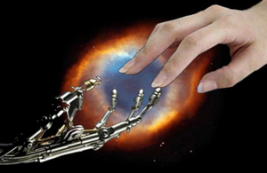
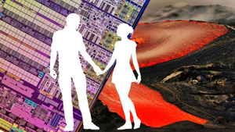
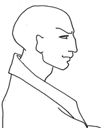
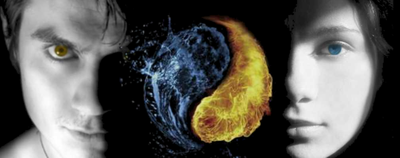

Здравствуй, уважаемый читатель! На этой страничке я подвожу некоторые итоги своего литературного творчества.
Почти все мои мысли, которые я превратил в повести, рассказы и стихи - посвящены людям с техническим складом ума.
Программисты и инженеры - не черствые сухари, а глубоко чувствующие и переживающие души. За математическими
формулами, чертежами и программным кодом скрывается трепетная душа, способная любить и ненавидеть.

## Цикл "Хаос-разведка"

*" ...Если говорить по-простому – я абсолютно слился с толпой, и выделить меня из нее было 
так же невозможно, как, например, невозможно вскрыть современный сильный шифр. Отныне 
все мои действия для окружающего мира будут выглядеть, как случайные события без какой–либо 
причинно-следственной связи. Их будет невозможно сопоставить и связать в какие-то логические 
цепочки. Я нахожусь и существую в энтропийном поле ниже уровня помехи.
Я оказался под защитой сил могущественней чем начальники, политики, армия, флот, интернет, 
военно-космические силы. Отныне мои ангелы–хранители были – математика, логика, физика, 
кибернетика. И все силы ада теперь перед ними стали беспомощны, как маленькие дети..."*

- [Сердце друга](novels/chaos_01_heart.html)
- [Те, которых нет](novels/chaos_02_nobodies.html)
- [Протокол "Энтропия"](novels/chaos_03_entropia.html)
- [Проект "Ариадна"](novels/chaos_04_ariadna.html)
- [Шторм на системной шине](novels/chaos_05_storm.html)

## Цикл "Медные реки"

*"...Последнее время я живу, как в летаргическом сне. Многоэтажные SQL-запросы, HTML-шаблоны и 
прочие ИТ-погремушки пишутся практически не приходя в сознание. Из этого состояния меня 
не могут вытащить ни премии, ни тимбилдинг, ни мотивирующие семинары, ни прочие пляски 
с бубнами различных корпоративных шаманов. Но когда мне становится известно, что кто-то 
хочет что-то сделать с целыми числами, превышающими разрядность процессора (пусть даже просто сложить), 
я отчетливо слышу этот незаметный для всех щелчок затвора. Математика – это самое грозное оружие. 
Я понимаю, что кто-то выковывает себе меч. А может меч выкован и уже занесен..."*

- [Ада - последняя программистка](novels/river_01_ada.html)
- [Медные реки](novels/river_02_cuprum.html)
- [Степень свободы](novels/river_03_degree.html)
- [Девять микрон](novels/river_04_nine.html)
- [river_05_outsider](novels/river_05_outsider.html)
- [river_06_masters](novels/river_06_masters.html)
- [river_07_claster](novels/river_07_claster.html)
- [river_08_winner](novels/river_08_winner.html)
- [river_09_virus](novels/river_09_virus.html)
- [river_10_command](novels/river_10_command.html)
- [river_11_heat](novels/river_11_heat.html)
- [river_12_click](novels/river_12_click.html)
- [river_13_bredni](novels/river_13_bredni.html)

## Цикл "Я не робот"

*"...Они поцеловались, озаренные светом Сверхновой. Что будет дальше, они не знали. 
Согласно новой американской теории весь мир должен был погибнуть от жесткого излучения. 
Согласно русской традиционной школе астрофизики, никакой опасности не было, и человечество 
могло спокойно заниматься своими делами. Но влюбленным было по большому счету все равно. 
Ведь они были вместе..."*

- [robot_01_real](novels/robot_01_real.html)
- [robot_02_wind](novels/robot_02_wind.html)
- [robot_03_paradise](novels/robot_03_paradise.html)
- [robot_04_programmer](novels/robot_04_programmer.html)
- [robot_05_pulsar](novels/robot_05_pulsar.html)
- [robot_06_finite](novels/robot_06_finite.html)
- [robot_07_woodmaster](novels/robot_07_woodmaster.html)
- [robot_08_rms](novels/robot_08_rms.html)
- [robot_09_mobile](novels/robot_09_mobile.html)

## Цикл "Небесные сервера"

*...  
Знай правило простое наперед  
Творец себе подобных создает  
Не знает чип, зачем он вычисляет  
Не знает человек, зачем живет  
...*

- [В глубокой отладке](novels/lyrics_01_deep.html)
- [Все живы, кто любил](novels/lyrics_02_live.html)
- [Электронные рубаи](novels/lyrics_03_rubai.html)

## Цикл "Невидимое солнце"

*"...Со временем перестаешь обращать внимание только на очевидное и начинаешь смотреть вглубь, 
за грань внешних проявлений. Постепенно приходишь к мысли, что существует другой, Невидимый Мир. 
Понимаешь, что именно там, в Невидимом, находятся истоки всех явлений и событий. Общаясь 
с людьми, все больше ощущаешь, исходящие из них потоки энергии. Теперь уже я твердо 
уверен - в каждом из нас ярко светит Невидимое Солнце. Но самая большая тайна жизни 
открывается, когда понимаешь, что Невидимое Солнце, как и обычное - одно на всех..."*

- [sun_01_save](novels/sun_01_save.html)
- [sun_02_hair](novels/sun_02_hair.html)
- [sun_03_invisible](novels/sun_03_invisible.html)
- [sun_04_ascent](novels/sun_04_ascent.html)
- [sun_05_aristotel](novels/sun_05_aristotel.html)
- [sun_06_drops](novels/sun_06_drops.html)
- [sun_07_pescar](novels/sun_07_pescar.html)
- [sun_08_bag](novels/sun_08_bag.html)
- [sun_09_room](novels/sun_09_room.html)
- [sun_10_noize](novels/sun_10_noize.html)
- [sun_11_scince](novels/sun_11_scince.html)
- [sun_12_voice](novels/sun_12_voice.html)
- [sun_14_river](novels/sun_14_river.html)
- [sun_15_achronic](novels/sun_15_achronic.html)

## Цикл "Темная сторона"

*"...Я здесь и сейчас. Мне все ясно. Достигнута необыкновенная легкость мышления. Прошлое 
растворилось в настоящем и стало новой гранью восприятия. Будущее из потока скомканных 
вероятностей превратилось в яркий мир безграничных возможностей. Все, как описывалось 
в древних трактатах. Никогда бы не поверил, в то, что происходит со мной в данный момент..."*

- [В раю секса не будет](novels/dark_01_sex.html)
- [Манифест о дружбе и любви](novels/dark_02_manifest.html)
- [Спуститесь с гор - напейтесь воды](novels/dark_03_mounts.html)

