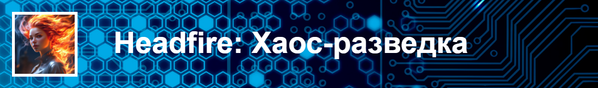

Программисты и инженеры - не черствые сухари, а глубоко чувствующие и переживающие души. За математическими
формулами, чертежами и программным кодом скрывается трепетная душа, способная любить и ненавидеть.

 
 

## Цикл "Хаос-разведка"

Cкрыться в хаосе - иногда единственно-правильное решение.

- [+Хаос-разведка 01 - Сердце друга](novels/chaos_01_heart.html)
- [+Хаос-разведка 02 - Те, которых нет](novels/chaos_02_nobodies.html)
- [Хаос-разведка 03 - Протокол "Энтропия"](novels/chaos_03_entropia.html)
- [+Хаос-разведка 04 - Проект "Ариадна"](novels/chaos_04_ariadna.html)
- [+Хаос-разведка 05 - Шторм на системной шине"](novels/chaos_05_storm.html)

 
 

## Цикл "Медные реки"

Про дружбу, первую любовь, странные компьютеры и дьявольски хитрый изобретения российских ученых

- [Медные реки](novels/rivers_01_cuprum.html)
- [+Ада -- Последняя программистка](novels/rivers_02_ada.html)
- [+Кластер (не выверено)](novels/rivers_03_claster.html)
- [+Степень свободы (не выверено)](novels/rivers_04_freedom.html)
- [+Город мастеров (не выверено)](novels/rivers_05_masters.html)
- [+Девять микрон (не выверено)](novels/rivers_06_micron.html)
- [+Грипп (не выверено)](novels/rivers_07_virus.html)
- [+Победитель (не выверено)](novels/rivers_08_winner.html)
- [+Плотник (не выверено)](novels/rivers_09_wood.html)

 
 

## Не выверено

- [robot_e_paradise](novels/robot_e_paradise.html)
- [robot_finite_automat](novels/robot_finite_automat.html)
- [robot_mobile_bank](novels/robot_mobile_bank.html)
- [robot_programmer](novels/robot_programmer.html)
- [robot_pulsar](novels/robot_pulsar.html)
- [robot_rms](novels/robot_rms.html)
- [robot_side_man](novels/robot_side_man.html)
- [robot_true_life](novels/robot_true_life.html)
- [robot_wind_3d](novels/robot_wind_3d.html)
- [they_frends_heart](novels/they_frends_heart.html)
- [they_nobodyes](novels/they_nobodyes.html)
- [they_storm](novels/they_storm.html)

---

C другими проектами вы можете ознакомиться на домашней странице [@Headfire](/home)
