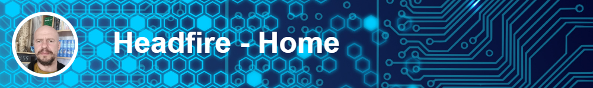
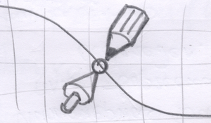
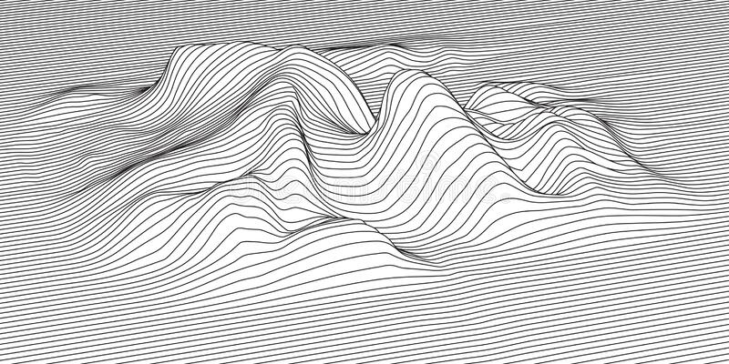

 

Добро пожаловать на домашнюю страничку Headfire -- программиста и фантазера. Здесь вы найдете
интересные сочинения, графические материалы, и, конечно, программный код.

 
 

## Творческая мастерская -- "Точка сборки 3D"

Творческая мастерская "Точка сборки 3D" -- это особо прочный сплав из вдохновения, хаоса и конструкторской точности.
Здесь находятся презентационные, конструкторские и научные материалы, созданные с применением трехмерного моделирования: STL-модели, 
DXF-чертежи и развертки, инструкции в формате MD и PDF, ссылки на видео YouTube, также самое интересное - трехмерные стерео-слады.

[Перейти в творческую мастерскую...](point/index.html)

 
 

## Литературная страничка -- "Хаос-разведка"

Интересные истории о программистах. Программисты -- не сухие технари. Под формальным покровом скрывается тонкая душа,
способная любить, ненавидеть, сомневаться и надеятся. А технический склад ума выкручивает все эти чувства 
на максимум и придает им налет тайны.

>А мир говорит, как ты можешь быть так спокоен 
>Надвигается шторм, который разорвет саму суть бытия, 
>А я говорю, мир - ты так и не понял: 
>Да, надвигается шторм, шторм -- это я 
> 
>Б.Г.

[Перейти на литературную страничку...](chaos/index.html)

 
 

## Легкий путь -- "Нирвана GTD"

Программисты -- творческие натуры, и часто они бывают "не от мира сего". Бывает очень сложно жить,
когда в голове совершенный код, идеальный мир, и вращаются хрустальные сферы. 
Здесь собран набор принципов, лайфхаков и советов, которые помогут вам сохранить оптимизм и 
творческий потенциал в этом иногда жестоком и нелогичном мире.

Обычно GTD-системы нацелены на повышение продуктивности и увеличении количества выполняемых дел.
Система "Нирвана GTD" - это легкий путь к уменьшению повседневных проблем, к выходу из цикла непрерывных обязанностей,
и к перемещению в пространство творчества и радостного общения.

[Вступить на легкий путь...](nirvana/index.html)

 
 

## Идей еще море - следите за обновлениями!

 

 

--- 

*Как проповедь ни хороша*  
*Я б все же предпочел,*  
*Чтоб объяснивший верный путь*  
*Со мной тот путь прошел.*  

*Пусть что угодно говорят,*  
*Хочу я видеть как*  
*Рука творит, а не слова*  
*Слетают с языка.*

---

Headfire --
[GitHub](https://github.com/headfire) --
[YouTube](https://www.youtube.com/channel/UCM4ZKGjRaWpOrHx_RuSHyig) --
[Хабр](https://habr.com/ru/users/headfire/posts/) --
[E-mail](mailto:headfire@yandex.ru)

